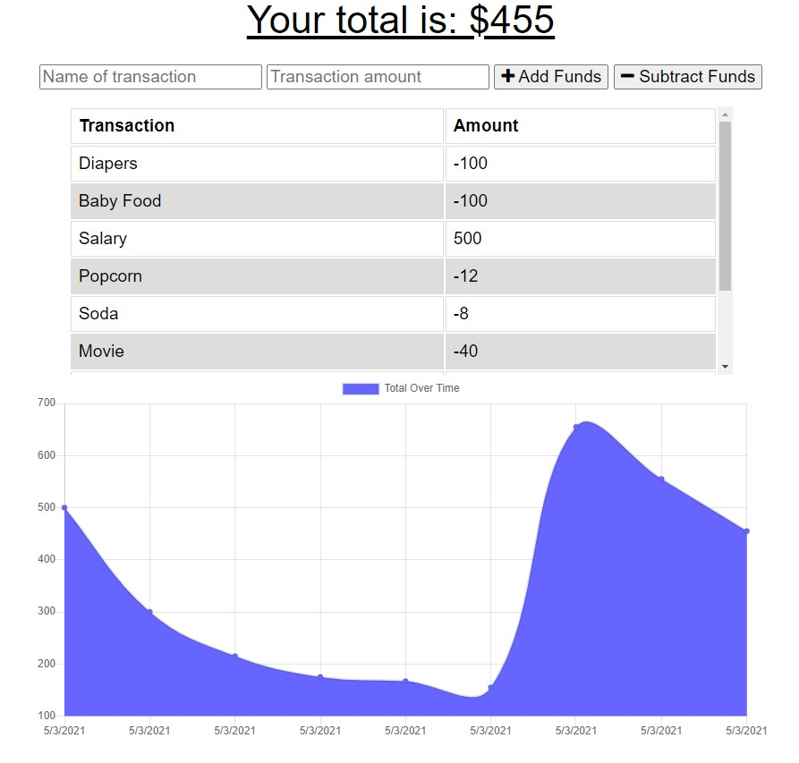

# Homework_16_PWA_Online_Offline_Budget_Tracker

# Online/Offline Budget Trackers

## Table of Contents 
- [Description](#description) 
- [Installation](#installation) 
- [Usage](#usage)
- [Testing](#testing)
- [Contribute](#contribute)
- [Credits](#credits) 
- [License](#license) 
- [Questions](#questions) 

## Description

Add functionality to our existing Budget Tracker application to allow for offline access and functionality.

Click <a href = "https://radiant-headland-44655.herokuapp.com/">here for the deployed application</a>.

This project may have some requeriments you need to meet in order to compile it. 
You may need NodeJS in order to run javascript on the console and install dependecnies. You can go to the NodeJS site and follow trough the installation process.  After you get the node command on the console, you will have the node package manager npm as well. Please read the package instruction section below.

## Installation:
These instructions will get you a copy of the project up and running on your local machine for development and testing purposes. 

The user will be able to add expenses and deposits to their budget with or without a connection. When entering transactions offline, they should populate the total when brought back online.

## Usage:
Used for educational purposes.

In order to start using the project you need to clone it to your computer. Or you can download the the zip version.
After you have it on you pc, you need to go in the console to the project folder and execute the following command to gather all the dependencies.

> npm install

## Testing:
No testing.

## Contributing: 
Mike Marino

To contribute to < strong > Big Bad Readme generator < /strong>, follow these steps:

Create a branch:
>git checkout - b <branch_name>

Make your changes and commit them:
>git commit - m '<commit_message>'

Push to the original branch:
>git push origin <project_name>/<location>

Create the pull request. Alternatively see the GitHub documentation on creating a pull request.

## Credits:
Mike Marino
## License:
This project uses the following license: 

https://opensource.org/licenses/MPL-2.0

This Source Code Form is subject to the terms of the Mozilla PublicLicense, v. 2.0. If a copy of the MPL was not distributed with this file, You canobtain one at https://mozilla.org/MPL/2.0/.

## Questions:
For all questions about this project, please email marino1820@gmail.com

Copyright(c) 2021 mikeMarino
